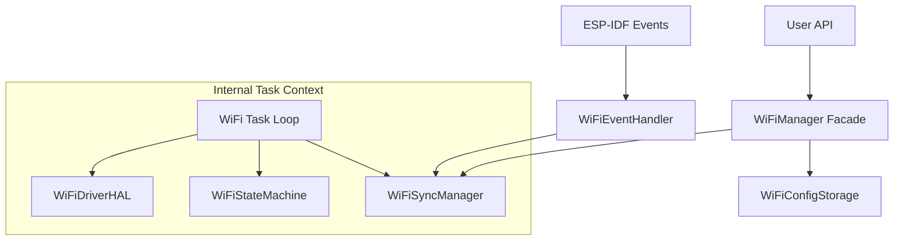

# WiFiManager Internal Design

This document explains the internal architecture, message flow, and state machine logic of the `WiFiManager` component.

## Architecture Overview

The refactored `WiFiManager` follows a **Component-Based Architecture** driven by a central **Message Loop**. It decomposes responsibilities into specialized classes to ensure modularity and testability.

### High-Level Diagram



## Key Components

### 1. WiFiManager (The Orchestrator)
- **Role**: Facade and Main Task entry point.
- **Responsibilities**: 
    - Initializes all sub-components.
    - Runs the main FreeRTOS task loop.
    - Dispatches messages to the appropriate handlers.
    - Coordinates the interaction between FSM, HAL, and Sync layers.

### 2. WiFiStateMachine (The Brain)
- **Role**: Pure logic component.
- **Responsibilities**:
    - Defines all States, Events, and Commands.
    - Maintenance of the **Transition Matrix** (State + Event -> Next State).
    - Maintenance of the **Command Matrix** (State + Command -> Allowed?).
    - **No side effects**: It only returns *decisions* (e.g., "Transition to CONNECTING", "Set Connected Bit").

### 3. WiFiSyncManager (The Nervous System)
- **Role**: Concurrency and Synchronization.
- **Responsibilities**:
    - Wraps FreeRTOS `QueueHandle_t` (Command Queue).
    - Wraps FreeRTOS `EventGroupHandle_t` (Status Bits).
    - Provides thread-safe methods for posting messages (`post_message`) and waiting for results (`wait_for_result`).
    - Centralizes timeout handling.

### 4. WiFiDriverHAL (The Limbs)
- **Role**: Hardware Abstraction Layer.
- **Responsibilities**:
    - Wraps all raw `esp_wifi_*` and `esp_netif_*` calls.
    - Provides a clean C++ interface for driver operations.
    - Allows mocking hardware interactions for unit testing.

### 5. WiFiConfigStorage (The Memory)
- **Role**: Persistence.
- **Responsibilities**:
    - Handles NVS (Non-Volatile Storage) operations.
    - Saves and loads WiFi credentials.
    - Manages the "validity" flag to prevent boot loops on bad credentials.

### 6. WiFiEventHandler (The Senses)
- **Role**: Event Translation.
- **Responsibilities**:
    - Receives raw `void*` events from the ESP-IDF Event Loop.
    - Translates them into strongly-typed `WiFiStateMachine::EventId`.
    - Posts them to the `WiFiSyncManager` queue.

---

## Message Flows

### 1. Synchronous Command Flow (e.g., `connect(timeout)`)

1.  **User Call**: `WiFiManager::connect(timeout)`.
2.  **Validation**: Queries `WiFiStateMachine` to see if `CONNECT` is allowed in current state.
3.  **Posting**: Calls `WiFiSyncManager::post_message(COMMAND_CONNECT)`.
4.  **Waiting**: Calls `WiFiSyncManager::wait_for_result(CONNECTED_BIT, timeout)`. The user task blocks here.
5.  **Processing**:
    *   `wifi_task` wakes up, dequeues the command.
    *   Calls `WiFiDriverHAL::connect()`.
6.  **Signaling**:
    *   Eventually, a system event (e.g., `STA_CONNECTED`) or error arrives.
    *   `WiFiSyncManager` sets the `CONNECTED_BIT` (driven by FSM logic).
    *   The user task unblocks and returns `ESP_OK`.

### 2. System Event Flow (e.g., `STA_CONNECTED`)

1.  **System Event**: ESP-IDF triggers the callback.
2.  **Translation**: `WiFiEventHandler` converts it to `EVENT_STA_CONNECTED`.
3.  **Queuing**: Events are posted to `WiFiSyncManager` using `xQueueSendFromISR`.
4.  **Dispatch**:
    *   `wifi_task` processes the event.
    *   Queries `WiFiStateMachine::resolve_event` which returns:
        *   **Next State**: `CONNECTED_NO_IP`
        *   **Bits to Set**: `CONNECTED_BIT` (maybe, depending on logic)
    *   `WiFiManager` updates the state and applies the bits.

---

## State Machine Logic

The state machine is strict. Transitions are defined in `WiFiStateMachine::transition_matrix`.

```mermaid
state_diagram
    [*] --> INITIALIZED
    INITIALIZED --> STARTING : Command: START
    STARTING --> STARTED : Event: STA_START
    
    STARTED --> STOPPING : Command: STOP
    STOPPING --> INITIALIZED : Event: STA_STOP
    
    STARTED --> CONNECTING : Command: CONNECT
    CONNECTING --> CONNECTED_NO_IP : Event: STA_CONNECTED
    
    CONNECTED_NO_IP --> CONNECTED_GOT_IP : Event: GOT_IP
    
    CONNECTED_GOT_IP --> DISCONNECTING : Command: DISCONNECT
    DISCONNECTING --> STARTED : Event: STA_DISCONNECTED
    
    %% Error / Retry Paths
    CONNECTING --> WAITING_RECONNECT : Event: STA_DISCONNECTED / TIMEOUT
    WAITING_RECONNECT --> CONNECTING : Timer Expired (Retry)
    WAITING_RECONNECT --> ERROR_CREDENTIALS : Max Retries Reached
```
