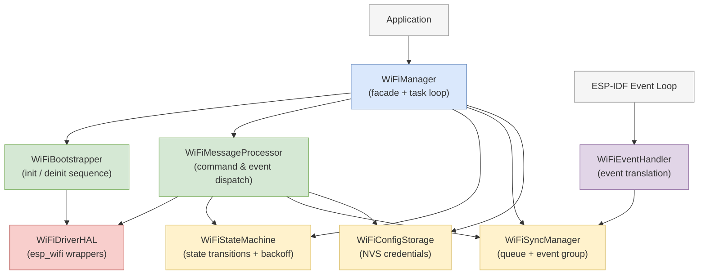
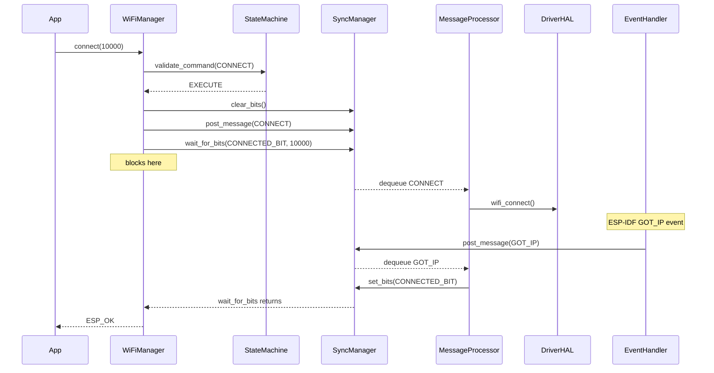
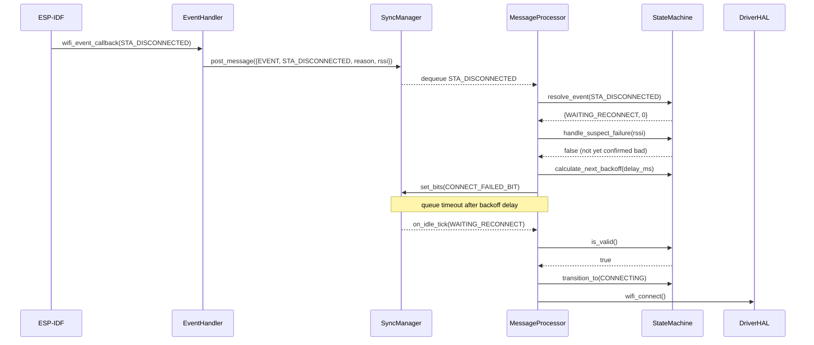
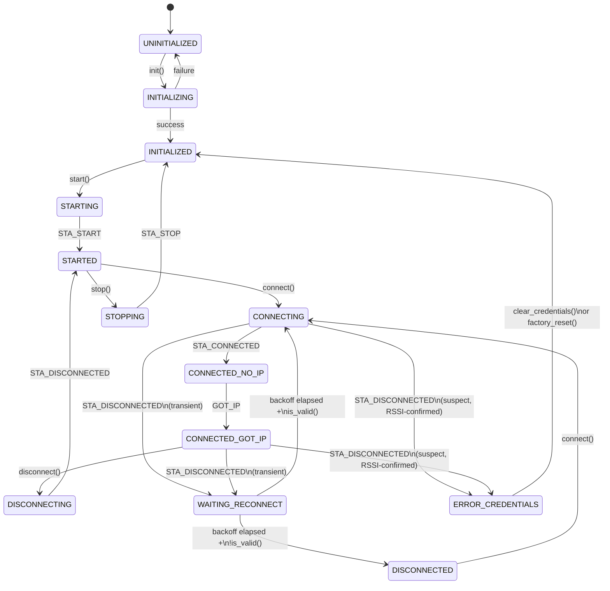

# WiFiManager — Internal Design

This document explains the internal architecture, component responsibilities, message flows, state machine logic, and the rationale behind key design decisions.

---

## 1. Architecture Overview

The component follows a **facade + message loop** pattern. `WiFiManager` is the public entry point and task owner. All WiFi logic is delegated to specialized collaborators injected at construction time.

```mermaid
graph TD
    App["Application"] --> WM["WiFiManager\n(facade + task loop)"]

    WM --> BS["WiFiBootstrapper\n(init / deinit sequence)"]
    WM --> MP["WiFiMessageProcessor\n(command & event dispatch)"]
    WM --> SM["WiFiStateMachine\n(state transitions + backoff)"]
    WM --> SY["WiFiSyncManager\n(queue + event group)"]
    WM --> ST["WiFiConfigStorage\n(NVS credentials)"]

    BS --> HAL["WiFiDriverHAL\n(esp_wifi wrappers)"]
    MP --> HAL
    MP --> SM
    MP --> SY
    MP --> ST

    EV["ESP-IDF Event Loop"] --> EH["WiFiEventHandler\n(event translation)"]
    EH --> SY

    style App fill:#f5f5f5,stroke:#999
    style WM fill:#dae8fc,stroke:#6c8ebf
    style BS fill:#d5e8d4,stroke:#82b366
    style MP fill:#d5e8d4,stroke:#82b366
    style SM fill:#fff2cc,stroke:#d6b656
    style SY fill:#fff2cc,stroke:#d6b656
    style ST fill:#fff2cc,stroke:#d6b656
    style HAL fill:#f8cecc,stroke:#b85450
    style EH fill:#e1d5e7,stroke:#9673a6
    style EV fill:#f5f5f5,stroke:#999
```

---

## 2. Components

| Component | Role | Owned by |
|---|---|---|
| `WiFiManager` | Facade, task loop, public API | Application (singleton) |
| `WiFiBootstrapper` | Init/deinit sequence, task creation | `WiFiManager` |
| `WiFiMessageProcessor` | Command and event handling logic | `WiFiManager` |
| `WiFiStateMachine` | State transitions, command validation, backoff | `WiFiManager` |
| `WiFiSyncManager` | FreeRTOS queue + event group | `WiFiManager` |
| `WiFiConfigStorage` | NVS credential persistence | `WiFiManager` |
| `WiFiDriverHAL` | `esp_wifi_*` / `esp_netif_*` wrappers | `WiFiBootstrapper`, `WiFiMessageProcessor` |
| `WiFiEventHandler` | ESP-IDF event → typed message translation | Registered by `WiFiBootstrapper` |

### WiFiManager
The public facade. Owns all collaborators via `unique_ptr` to interfaces. Runs the `wifi_task` loop which dequeues messages and delegates processing. Exposes both synchronous (blocking with timeout) and asynchronous (fire-and-forget) variants of each command. Protects state reads with a recursive mutex shared with the task.

### WiFiBootstrapper
Encapsulates the full `esp_netif` / `esp_event` / `esp_wifi` initialization sequence, event handler registration, sync manager initialization, and task creation. Mirrors the same sequence in `deinit` in reverse order, accumulating errors without aborting cleanup. Accepts `TaskFunction_t` as a parameter — it does not know which function the task runs.

### WiFiMessageProcessor
Handles what to do with each message the task dequeues. Commands (`START`, `STOP`, `CONNECT`, `DISCONNECT`) drive driver calls and state transitions. Events (`STA_DISCONNECTED`, `GOT_IP`) drive outcome resolution via the state machine and credential validation logic. The idle tick path (queue timeout) handles the `WAITING_RECONNECT` → `CONNECTING` transition.

### WiFiStateMachine
Pure logic, no side effects. Maintains the command validation matrix (State × Command → Action) and the event outcome matrix (State × Event → NextState + BitsToSet). Manages retry counters and exponential backoff calculation. The `handle_suspect_failure` method evaluates RSSI against thresholds before invalidating credentials.

### WiFiSyncManager
Wraps a FreeRTOS `QueueHandle_t` and `EventGroupHandle_t`. Provides `post_message`, `wait_for_bits`, `set_bits`, and `clear_bits`. All blocking primitives go through here, making timeout behavior fully controllable in tests by mocking this interface.

### WiFiConfigStorage
NVS-backed storage for up to 10 SSID/password pairs. Calls `nvs_flash_init()` internally. Tracks a `valid` flag that distinguishes "has working credentials" from "has stored credentials". Syncs the active credential to the driver via `WiFiDriverHAL::wifi_set_config` on every write.

### WiFiDriverHAL
Pure 1:1 delegation to `esp_wifi_*` and `esp_netif_*` functions. No logic, no state. The only purpose is to make the ESP-IDF calls injectable and mockable. All methods use `::` to force global scope and avoid recursion.

### WiFiEventHandler
Receives raw `void*` events from the ESP-IDF event loop. Extracts typed data (`wifi_event_sta_disconnected_t`, `ip_event_got_ip_t`) and posts strongly-typed `Message` structs to the `WiFiSyncManager` queue. Stateless — safe to use as a static callback.

---

## 3. Message Flows

### Synchronous command — `connect(timeout_ms)`

```mermaid
sequenceDiagram
    participant App
    participant WM as WiFiManager
    participant SM as StateMachine
    participant SY as SyncManager
    participant MP as MessageProcessor
    participant HAL as DriverHAL
    participant EH as EventHandler

    App->>WM: connect(10000)
    WM->>SM: validate_command(CONNECT)
    SM-->>WM: EXECUTE
    WM->>SY: clear_bits()
    WM->>SY: post_message(CONNECT)
    WM->>SY: wait_for_bits(CONNECTED_BIT, 10000)
    note over WM: blocks here

    SY-->>MP: dequeue CONNECT
    MP->>HAL: wifi_connect()

    note over EH: ESP-IDF GOT_IP event
    EH->>SY: post_message(GOT_IP)
    SY-->>MP: dequeue GOT_IP
    MP->>SY: set_bits(CONNECTED_BIT)

    SY-->>WM: wait_for_bits returns
    WM-->>App: ESP_OK
```

### Event flow — `STA_DISCONNECTED` (transient failure)

```mermaid
sequenceDiagram
    participant EV as ESP-IDF
    participant EH as EventHandler
    participant SY as SyncManager
    participant MP as MessageProcessor
    participant SM as StateMachine
    participant HAL as DriverHAL

    EV->>EH: wifi_event_callback(STA_DISCONNECTED)
    EH->>SY: post_message({EVENT, STA_DISCONNECTED, reason, rssi})

    SY-->>MP: dequeue STA_DISCONNECTED
    MP->>SM: resolve_event(STA_DISCONNECTED)
    SM-->>MP: {WAITING_RECONNECT, 0}
    MP->>SM: handle_suspect_failure(rssi)
    SM-->>MP: false (not yet confirmed bad)
    MP->>SM: calculate_next_backoff(delay_ms)
    MP->>SY: set_bits(CONNECT_FAILED_BIT)

    note over SY,MP: queue timeout after backoff delay

    SY-->>MP: on_idle_tick(WAITING_RECONNECT)
    MP->>SM: is_valid()
    SM-->>MP: true
    MP->>SM: transition_to(CONNECTING)
    MP->>HAL: wifi_connect()
```

---

## 4. State Machine

States, transitions, and the conditions that drive them.

```mermaid
stateDiagram-v2
    [*] --> UNINITIALIZED
    UNINITIALIZED --> INITIALIZING : init()
    INITIALIZING --> INITIALIZED : success
    INITIALIZING --> UNINITIALIZED : failure

    INITIALIZED --> STARTING : start()
    STARTING --> STARTED : STA_START

    STARTED --> CONNECTING : connect()
    CONNECTING --> CONNECTED_NO_IP : STA_CONNECTED
    CONNECTED_NO_IP --> CONNECTED_GOT_IP : GOT_IP

    CONNECTED_GOT_IP --> DISCONNECTING : disconnect()
    DISCONNECTING --> STARTED : STA_DISCONNECTED

    STARTED --> STOPPING : stop()
    STOPPING --> INITIALIZED : STA_STOP

    CONNECTING --> WAITING_RECONNECT : STA_DISCONNECTED\n(transient)
    CONNECTED_GOT_IP --> WAITING_RECONNECT : STA_DISCONNECTED\n(transient)
    WAITING_RECONNECT --> CONNECTING : backoff elapsed +\nis_valid()

    CONNECTING --> ERROR_CREDENTIALS : STA_DISCONNECTED\n(suspect, RSSI-confirmed)
    CONNECTED_GOT_IP --> ERROR_CREDENTIALS : STA_DISCONNECTED\n(suspect, RSSI-confirmed)
    WAITING_RECONNECT --> DISCONNECTED : backoff elapsed +\n!is_valid()

    DISCONNECTED --> CONNECTING : connect()
    ERROR_CREDENTIALS --> INITIALIZED : clear_credentials()\nor factory_reset()
```

### State descriptions

| State | Description |
|---|---|
| `UNINITIALIZED` | Initial state. No resources allocated. |
| `INITIALIZING` | `init()` sequence in progress. |
| `INITIALIZED` | Resources ready. WiFi not started. |
| `STARTING` | Waiting for `STA_START` event after `esp_wifi_start()`. |
| `STARTED` | WiFi started. Not connected. |
| `CONNECTING` | `esp_wifi_connect()` called. Waiting for association. |
| `CONNECTED_NO_IP` | Associated with AP. Waiting for DHCP. |
| `CONNECTED_GOT_IP` | Fully connected. IP obtained. |
| `DISCONNECTING` | `esp_wifi_disconnect()` called deliberately. |
| `STOPPING` | `esp_wifi_stop()` called. |
| `WAITING_RECONNECT` | Transient failure. Backoff timer running. |
| `DISCONNECTED` | Credentials invalid. No reconnection attempted. |
| `ERROR_CREDENTIALS` | Credentials confirmed bad by RSSI-aware logic. Safe idle state. |

### Credential invalidation logic

`STA_DISCONNECTED` with an auth-related reason (`AUTH_FAIL`, `4WAY_HANDSHAKE_TIMEOUT`, etc.) does not immediately invalidate credentials. Instead, `handle_suspect_failure(rssi)` applies RSSI-dependent retry limits:

| Signal | RSSI range | Retries before invalidation |
|---|---|---|
| Good | ≥ -55 dBm | 1 |
| Medium | ≥ -67 dBm | 2 |
| Weak | ≥ -80 dBm | 5 |
| Very weak | < -80 dBm | never invalidates — likely signal issue |

This prevents credential invalidation caused by marginal RF conditions rather than wrong passwords.

---

## 5. Design Decisions

### Why extract `WiFiBootstrapper`?

The original `WiFiManager::init()` contained ~80 lines of `esp_netif` / `esp_event` / `esp_wifi` sequencing with error handling and cleanup paths. This made `WiFiManager` difficult to test — any test touching `init()` had to mock a dozen HAL calls.

Extracting `WiFiBootstrapper` gave init/deinit a clear, testable boundary. `WiFiManager::init()` became three lines. `WiFiBootstrapper` tests verify the sequencing and cleanup without involving any `WiFiManager` logic.

### Why extract `WiFiMessageProcessor`?

Command and event handlers were private methods of `WiFiManager`. Private methods cannot be tested directly, so the only way to exercise `handle_start`, `handle_event`, etc. was through the full task loop — requiring a running FreeRTOS task and live queue.

Extracting `WiFiMessageProcessor` made every handler a public method on a concrete class with its own interface. Each handler is now tested directly with mocked collaborators, achieving 100% line coverage without any FreeRTOS involvement.

### Why is `WiFiDriverHAL` pure delegation?

An early version of the HAL absorbed `ESP_ERR_INVALID_STATE` from `esp_netif_init()` and managed an `wifi_init_done_` flag. This leaked policy into the HAL — making it stateful and harder to reason about.

The rule now is: HAL methods are 1:1 wrappers, always using `::function()` to force global scope. All policy (when to absorb errors, when to reuse existing handles) lives in `WiFiBootstrapper`. The HAL has no members, no logic, and needs no tests beyond what the bootstrapper tests cover indirectly.

### Why does `WiFiBootstrapper` accept `TaskFunction_t` as a parameter?

The bootstrapper needs to call `xTaskCreate` but should not depend on `WiFiManager` to know which function to run — that would create a circular dependency (`WiFiBootstrapper` → `WiFiManager` → `WiFiBootstrapper`).

Passing `TaskFunction_t task_fn` inverts the dependency: the bootstrapper receives a generic function pointer, and `WiFiManager::init()` passes `WiFiManager::wifi_task` explicitly. This also eliminated the trampoline function that previously existed only to bridge the two, and made the task function directly testable via a stub.

### Why does `ERROR_CREDENTIALS` not reconnect automatically?

`ERROR_CREDENTIALS` is reached only after RSSI-aware retry limits are exhausted — meaning the system has high confidence that the stored credentials are wrong, not that the signal is bad. Attempting reconnection from this state would cause an infinite loop of failed authentication attempts, which some access points penalize with temporary bans.

The state serves as a safe idle point. Future work will add AP scanning and provisioning triggered from this state, using it as the entry point rather than adding new states.

### Why store up to 10 credentials?

The single-credential model required the user to call `set_credentials` every time the device moved between known networks. The 10-slot model is groundwork for future automatic AP selection — the device can store home, office, and mobile hotspot credentials at setup time.

For now, `ap_cur_idx` always points to the most recently added entry. Automatic selection based on scan results (strongest known SSID) is the next step, planned alongside provisioning.

### Why does `WiFiConfigStorage` call `nvs_flash_init()` internally?

In the original design, the application was responsible for NVS initialization before calling `WiFiManager::init()`. This was a hidden precondition — easy to forget, hard to debug (silent `ESP_ERR_NVS_NOT_INITIALIZED` deep in the call stack).

Making `WiFiConfigStorage::init()` call `nvs_flash_init()` — and handle the erase/reinit cycle for invalid partitions — removes the precondition entirely. If the application also calls `nvs_flash_init()`, the second call is idempotent and harmless.