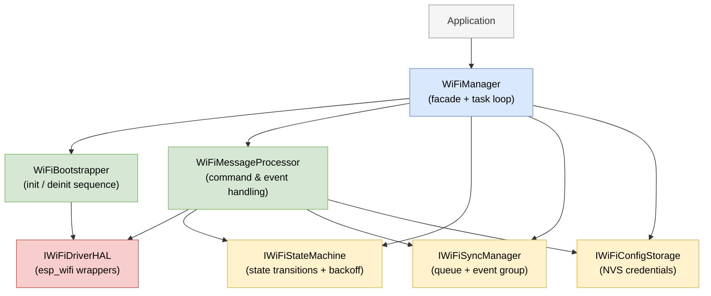
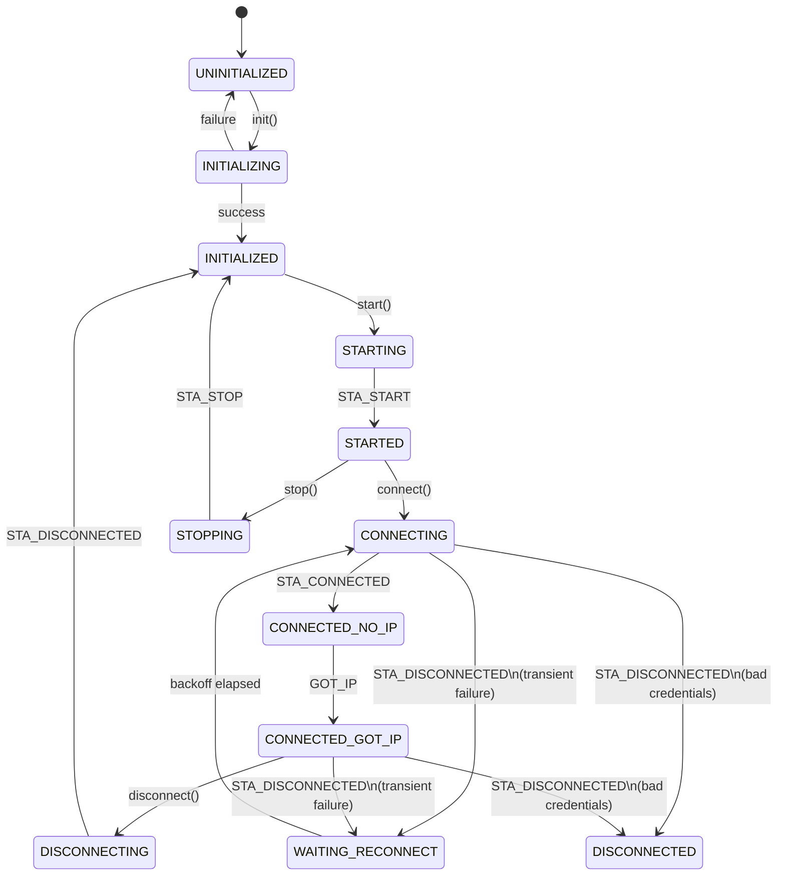

# WiFiManager Component

A thread-safe WiFi Station manager for ESP-IDF (v5.x).

[](https://github.com/aluiziotomazelli/wifi_manager/actions/workflows/build.yml)
[](https://github.com/aluiziotomazelli/wifi_manager/actions/workflows/host_test.yml)
[](https://aluiziotomazelli.github.io/wifi_manager/index.html)
[](https://components.espressif.com/components/aluiziotomazelli/wifi_manager)

ESP-IDF component available via the official [Component Registry](https://components.espressif.com/components/aluiziotomazelli/wifi_manager).

## Overview

`WiFiManager` wraps the low-level `esp_wifi` driver in a state-machine driven singleton. It handles NVS initialization internally, manages multiple credential entries, and provides both synchronous (blocking) and asynchronous (fire-and-forget) APIs — all from a dedicated FreeRTOS task.

Key features:
- **Singleton pattern**: Single access point from anywhere in the application
- **Dedicated task**: WiFi operations fully decoupled from the application thread
- **Multiple credentials**: Stores up to 10 SSIDs in NVS, always connecting with the most recently added
- **Automatic reconnection**: Exponential backoff retry loop for accidental disconnections
- **Credential invalidation**: Distinguishes bad credentials from transient failures
- **Thread-safe**: Mutex-protected state transitions and queue-based command dispatch
- **NVS managed internally**: No `nvs_flash_init()` needed in application code
- **Sync and async API**: Choose blocking or fire-and-forget per call
- **Signal-aware credential validation**: Authentication failures are evaluated against RSSI thresholds before invalidating credentials — weak signal gets more retries than strong signal, reducing false positives from marginal RF conditions.

## Quick Start

```cpp
#include "wifi_manager.hpp"

void app_main()
{
    auto &wm = WiFiManager::get_instance();

    wm.init();
    wm.start();
    wm.add_credentials("MySSID", "MyPassword");

    if (wm.connect(10000) == ESP_OK) {
        printf("Connected!\n");
    }
}
```

For the full API reference see [API.md](API.md).

## Architecture

The component is structured around a central `WiFiManager` facade that owns and coordinates five focused collaborators. For the full design rationale see [DESIGN.md](DESIGN.md).



All collaborators are injected via interfaces, making every layer independently testable without hardware.

## Typical Applications

### Connect and stay connected

The most common pattern — initialize once, add credentials, connect, and let the manager handle reconnections automatically.

```cpp
auto &wm = WiFiManager::get_instance();
wm.init();
wm.start();
wm.add_credentials("MySSID", "MyPassword");
wm.connect();  // async — returns immediately
```

### Blocking connect with timeout

Useful when subsequent code depends on network availability.

```cpp
esp_err_t err = wm.connect(15000);  // blocks up to 15 seconds
if (err == ESP_OK) {
    // proceed with network operations
} else if (err == ESP_ERR_TIMEOUT) {
    // handle no network available
}
```

### Multiple credentials

The manager stores up to 10 SSIDs. If the list is full, the last slot is silently overwritten. The most recently added credential is always used for the next connection attempt.

```cpp
wm.add_credentials("HomeSSID",   "HomePass");
wm.add_credentials("OfficeSSID", "OfficePass");
wm.add_credentials("MobileSSID", "MobilePass");
wm.connect(10000);
```

### Runtime credential update

Safe to call while connected — the manager disconnects, stores the new credentials, and the automatic reconnection loop picks them up.

```cpp
wm.add_credentials("NewSSID", "NewPassword");
wm.connect(10000);
```

### Factory reset

Clears all stored credentials from NVS, resets the validity flag, and resets state machine retry counters.

```cpp
wm.factory_reset();
```

## State Machine

The manager transitions through well-defined states driven by commands and WiFi events. Illegal transitions are rejected before reaching the driver.



## Integration Notes

### NVS initialization

`WiFiManager` calls `nvs_flash_init()` internally during `init()`. If the NVS partition is invalid or has a version mismatch, it erases and reinitializes automatically. There is no need to call `nvs_flash_init()` in application code, but it is safe to do so — subsequent calls are idempotent.

### Credential storage

Credentials are stored in a dedicated NVS namespace (`wifi_manager`). Up to 10 SSIDs are kept. Adding an SSID that already exists updates its password in place. If the list is full, slot 9 is silently overwritten. The `ap_cur_idx` key always points to the most recently added entry.

> `set_credentials` is available as a compatibility alias for `add_credentials` and behaves identically.

### Task priority

The WiFi task runs at priority **5**. This is currently fixed and not configurable at runtime or via Kconfig.

### Thread safety

All public methods are safe to call from any task. State transitions are protected by a recursive mutex; commands are dispatched through a FreeRTOS queue.

## Unit Testing

The test suite runs on the host (Linux) via Google Test with FreeRTOS POSIX simulation — no hardware required.

Coverage per component:

| Component | Lines | Functions | Branches |
|---|---|---|---|
| `WiFiStateMachine` | 100% | 100% | 100% |
| `WiFiEventHandler` | 100% | 100% | 100% |
| `WiFiMessageProcessor` | 100% | 100% | 94% |
| `WiFiManager` | 98% | 96% | 96% |
| `WiFiBootstrapper` | 95% | 100% | 80% |
| `WiFiConfigStorage` | 97% | 100% | 68% |

Full coverage report: [gh-pages](https://aluiziotomazelli.github.io/wifi_manager/index.html)

To run or know more about the tests, see [host_test/README](host_test/README.md).


## Current Limitations

- **No provisioning**: Credentials are set via `add_credentials()` only — no BLE/SoftAP provisioning yet
- **Fixed connection order**: Always connects using the most recently added credential, not the strongest signal
- **Fixed task priority**: Priority 5, not configurable
- **Single credential active**: Always connects using the most recently added credential, no automatic fallback to other stored SSIDs on failure.

## License

MIT

## Author

[github.com/aluiziotomazelli](https://github.com/aluiziotomazelli)

## Changelog

For a history of changes, see [CHANGELOG.md](CHANGELOG.md).